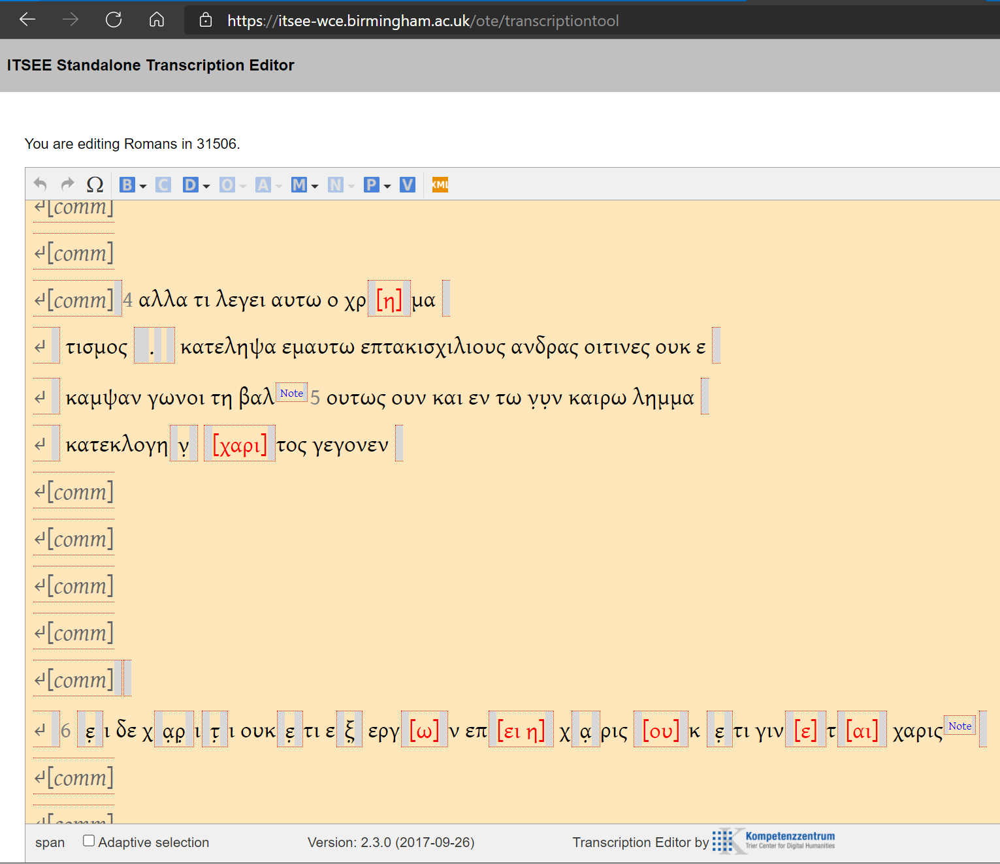

# Markdown for TEI Transcriptions - v 0.1

### Project Goals
1. Define a modified subset of markdown syntax
2. Converts the markdown transcription into a TEI XML encoded document that is compatible with the ITSEE/INTF [Online Transcription Editor](https://itsee-wce.birmingham.ac.uk/ote/transcriptiontool).
3. Produce JSON transcription files for use with the ITSEE [Collation Editor](https://github.com/itsee-birmingham/standalone_collation_editor)

### Requirements
- Python 3.6+ (tested on 3.9)
- [lxml](https://pypi.org/project/lxml/) 
- [Python-Markdown](https://pypi.org/project/Markdown/)
- [markdown-del-ins](https://pypi.org/project/markdown-del-ins/)
- [pytest](https://pypi.org/project/pytest/) (only needed if you intend to run the tests on the source code) 

### Using this Tool
- Clone or download this repository and navigate to the root folder in a console window.
- to convert the simple example, execute execute `python markdown_to_tei.py examples/simple_example.md`
This will use the default settings: the output file has the same name as the input file but the extension is changed to `.xml` and it is pretty printed.
- Use the -o flag and add an output location, e.g. `python markdown_to_tei.py examples/simple_example.md -o my_file.xml`
- Use the -l flag to signal that the output file should be formatted according to the transcription lines, one transcription line per line in the file.
- Use the -p flag to make remove unimportant whitespace (ideal for storage, not for reading).

## Repurposed and Modified Syntax | Simple Example
### markdown text
```markdown
# A Simple Transcription Example
## FirstName LastName
### 2021-05-12
...................................
#### Romans
##### 11
<pb n="323v"/>
<lb/> words are tokenized
<lb/><v n="5">shortcut tag for verse unit
<lb/> [supp]lied [text] in brackets
<lb/> unclear `text` in back`ticks`
<lb/> some text followed by commentary <comm/>
<comm lines="3"/>
<lb/> **marginalia in double-asterisks**
<lb/> a word bro-
<lb n="8"/>ken over two lines
<lb/> {unencoded notes in braces}
<lb/> *encoded editer's note in single asterisks*
<lb/> ++ corrcdet tetx | corrected text ++
<lb/> add attributes to an `element`{reason='damage to page'}</v>
#####
####
```
### rendered TEI
```xml
<!DOCTYPE TEI>
<TEI xmlns="http://www.tei-c.org/ns/1.0">
    <teiHeader>
        <fileDesc>
            <titleStmt>
                <title type="document">A Simple Transcription Example</title>
                <respStmt>
                    <resp when-iso="2021-05-12">Transcribed by</resp>
                    <name type="person">FirstName LastName</name>
                </respStmt>
            </titleStmt>
        </fileDesc>
    </teiHeader>
    <text xml:lang="grc">
        <body>
            <div type="book" n="B06">
                <div type="chapter" n="B06K11">
                    <pb n="323v" type="folio"/>
                    <lb/><w>words</w><w>are</w><w>tokenized</w>
                    <lb/><ab n="B06K11V5"><w>shortcut</w><w>tag</w><w>for</w><w>verse</w><w>unit</w>
                    <lb/><w><supplied>supp</supplied>lied</w><w><supplied>text</supplied></w><w>in</w><w>brackets</w>
                    <lb/><w>unclear</w><w><unclear>text</unclear></w><w>in</w><w>back<unclear>ticks</unclear></w>
                    <lb/><w>some</w><w>text</w><w>followed</w><w>by</w><w>commentary</w><note type="commentary">untranscribed commentary text</note>
                    <lb/><note type="commentary">One line of untranscribed commentary text</note>
                    <lb/><note type="commentary">One line of untranscribed commentary text</note>
                    <lb/><note type="commentary">One line of untranscribed commentary text</note>
                    <lb/><seg type="margin">marginalia in double-asterisks</seg>
                    <lb/><w>a</w><w>word</w><w>bro
                    <lb n="8"/>ken</w><w>over</w><w>two</w><w>lines</w>
                    <lb/>{unencoded notes in braces}
                    <lb/><note type="local">encoded editer's note in single asterisks</note>
                    <lb/><app><rdg type="orig" hand="firsthand"><w>corrcdet</w><w>tetx</w></rdg><rdg type="corr" hand="corrector"><w>corrected</w><w>text</w></rdg></app>
                    <lb/><w>add</w><w>attributes</w><w>to</w><w>an</w><w><unclear reason="damage to page">element</unclear></w></ab>
                </div>
            </div>
        </body>
    </text>
</TEI>
```

## A Real Example
### markdown text
```markdown
# A Transcription of GA 1506 {n='31506'} 
## David A Flood, II
### 2020-09-12
...................................
#### Romans
##### 11
<pb n="323v"/>
<comm lines="8"/>
<lb n="9"/><comm/><v n="4">αλλα τι λεγει αυτω ο χρ[η]μα-
<lb n="10"/>τισμος . κατεληψα εμαυτω επτακισχιλιους ανδρας οιτινες ουκ ε-
<lb n="11"/>καμψαν γωνοι τη βαλ *expected βααλ*</v><v n="5">ουτως ουν και εν τω ν̣υ̣ν καιρω λημμα 
<lb n="12"/>κατ εκλογη`ν` [χαρι]τος γεγονεν</v>
<comm lines="5"/>
<lb n="18"/><v n="6">`ε`ι δε χ`αρ`ι`τ`ι ουκ`ε`τι ε`ξ`{reason="see note"} εργ[ω]ν επ[ει] [η] χ`α`ρις [ου]κ `ε`τι γιν[ε]τ[αι] χαρις *this line is difficult to read because the reverse-side commentary is more visible than the front-facing lemma*
<comm lines="4"/>
<comm/></v>
#####
####
```

### rendered TEI
```xml
<!DOCTYPE TEI>
<TEI xmlns="http://www.tei-c.org/ns/1.0">
    <teiHeader>
        <fileDesc>
            <titleStmt>
                <title n="31506" type="document">A Transcription of GA 1506</title>
                <respStmt>
                    <resp when-iso="2020-09-12">Transcribed by</resp>
                    <name type="person">David A Flood, II</name>
                </respStmt>
            </titleStmt>
        </fileDesc>
    </teiHeader>
    <text xml:lang="grc">
        <body>
            <div type="book" n="B06">
                <div type="chapter" n="B06K11">
                    <pb n="323v" type="folio"/>
                    <lb/><note type="commentary">One line of untranscribed commentary text</note>
                    <lb/><note type="commentary">One line of untranscribed commentary text</note>
                    <lb/><note type="commentary">One line of untranscribed commentary text</note>
                    <lb/><note type="commentary">One line of untranscribed commentary text</note>
                    <lb/><note type="commentary">One line of untranscribed commentary text</note>
                    <lb/><note type="commentary">One line of untranscribed commentary text</note>
                    <lb/><note type="commentary">One line of untranscribed commentary text</note>
                    <lb/><note type="commentary">One line of untranscribed commentary text</note>
                    <lb n="9"/><note type="commentary">untranscribed commentary text</note><ab n="B06K11V4"><w>αλλα</w><w>τι</w><w>λεγει</w><w>αυτω</w><w>ο</w><w>χρ<supplied>η</supplied>μα
                    <lb n="10"/>τισμος</w><pc><w>.</w></pc><w>κατεληψα</w><w>εμαυτω</w><w>επτακισχιλιους</w><w>ανδρας</w><w>οιτινες</w><w>ουκ</w><w>ε
                    <lb n="11"/>καμψαν</w><w>γωνοι</w><w>τη</w><w>βαλ</w><note type="local">expected βααλ</note></ab><ab n="B06K11V5"><w>ουτως</w><w>ουν</w><w>και</w><w>εν</w><w>τω</w><w>ν̣υ̣ν</w><w>καιρω</w><w>λημμα</w>
                    <lb n="12"/>κατ<w>εκλογη<unclear>ν</unclear></w><w><supplied>χαρι</supplied>τος</w><w>γεγονεν</w></ab>
                    <lb/><note type="commentary">One line of untranscribed commentary text</note>
                    <lb/><note type="commentary">One line of untranscribed commentary text</note>
                    <lb/><note type="commentary">One line of untranscribed commentary text</note>
                    <lb/><note type="commentary">One line of untranscribed commentary text</note>
                    <lb/><note type="commentary">One line of untranscribed commentary text</note>
                    <lb n="18"/><ab n="B06K11V6"><w><unclear>ε</unclear>ι</w><w>δε</w><w>χ<unclear>αρ</unclear>ι<unclear>τ</unclear>ι</w><w>ουκ<unclear>ε</unclear>τι</w><w>ε<unclear reason="see note">ξ</unclear></w><w>εργ<supplied>ω</supplied>ν</w><w>επ<supplied>ει</supplied></w><w><supplied>η</supplied></w><w>χ<unclear>α</unclear>ρις</w><w><supplied>ου</supplied>κ</w><w><unclear>ε</unclear>τι</w><w>γιν<supplied>ε</supplied>τ<supplied>αι</supplied></w><w>χαρις</w>
                        <note type="local">
                            this line is difficult to read because the reverse-side commentary is more visible than the front-facing lemma
                        </note>
                    <lb/><note type="commentary">One line of untranscribed commentary text</note>
                    <lb/><note type="commentary">One line of untranscribed commentary text</note>
                    <lb/><note type="commentary">One line of untranscribed commentary text</note>
                    <lb/><note type="commentary">One line of untranscribed commentary text</note><note type="commentary">untranscribed commentary text</note></ab>
                </div>
            </div>
        </body>
    </text>
</TEI>
```
________________
## Rendered TEI is valid and can be uploaded to the ITSEE [Online Transcription Editor](https://itsee-wce.birmingham.ac.uk/ote/transcriptiontool)
______
This is above example loaded into the ITSEE Transcription Editor

